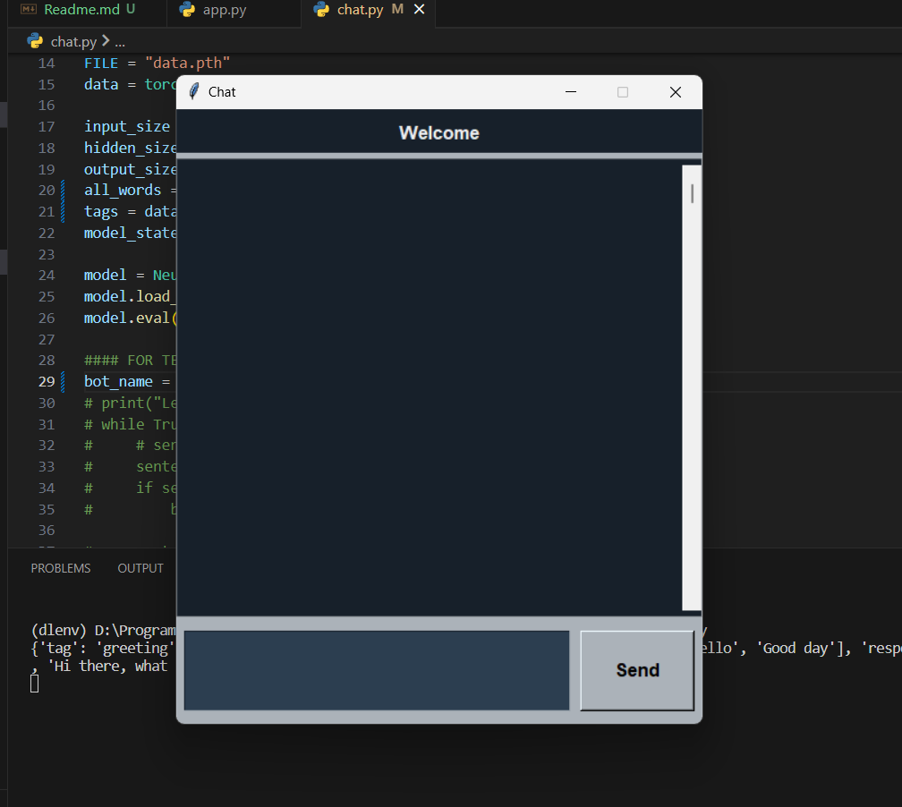
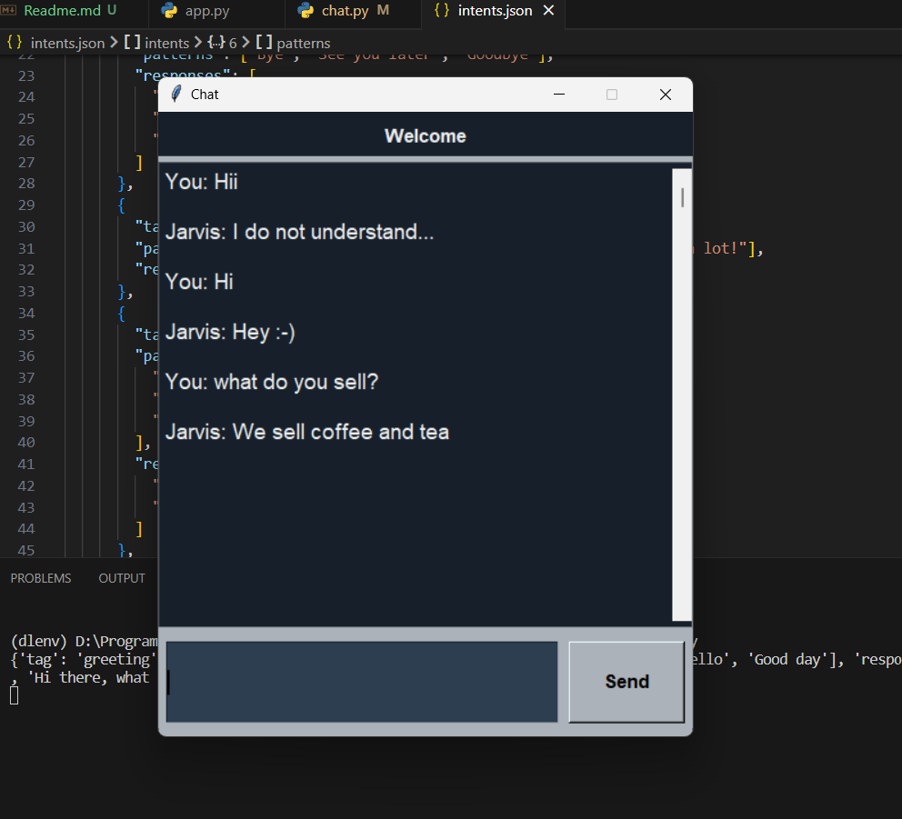

### About

It is a desktop application built for showcasing a simple Chat-Bot which is trained on simple Knowledge Base.
We've used the following Tech Stack:

- UI: Tkinter,
- Preprocessing: NLTK, Numpy,
- ML Algorithm: Simple ANN,

### How to use

Install all the dependencies using:

First go to terminal:

```bash
pip install -r requirements.txt
```

```bash
python app.py
```

Some previews




